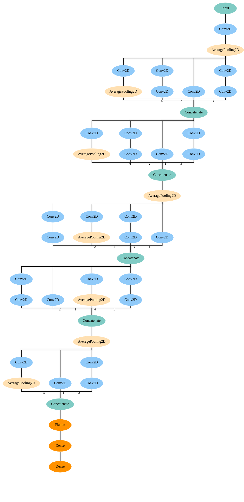
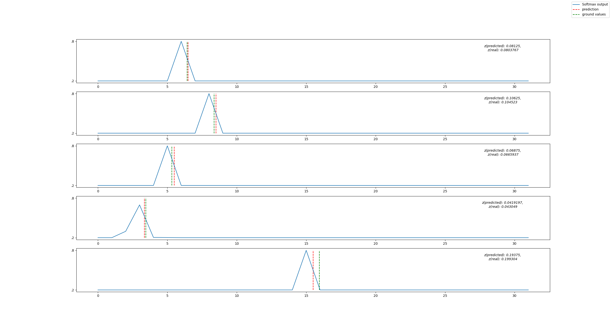

## REDSHIFT 
Redshift is a spectral measurement of how far from the earth the galaxy is moving. The [sdss](https://www.sdss.org/) is a survey conducted by a telescope in the night sky that takes pictures of various regions in the sky. In this repository, we present the preprocessing techniques for SDSS images as well as the code to the model presented by this [paper](https://arxiv.org/abs/1806.06607).

## Requirements
In order to run this repository, you will need the following:
1. [swarp](https://www.astromatic.net/software/swarp): To resample the SDSS images downloaded from the repository
2. python3 with keras and tensorflow installed. please check the requirements.txt to do a pip install

## What is in this repository?
In the preprocessing directory, there are the follwing major files
1. [.swarp.conf](./preprocessing/.swarp.conf): This file is the configuration file used by swarp to resample images as the authors have suggested in the paper
2. [spec_query.sql](./preprocessing/spec_query.sql): The SQL query the authors used in gathering the galaxy information from the [casjobs server](https://skyserver.sdss.org/casjobs/)
3. [image_getter.py](./preprocessing/image_getter.py): The python file to download the images from the SDSS [Archive server](https://data.sdss.org/sas/)
4. [swarp_wrapper.py](./preprocessing/swarp_wrapper.py): A quick wrapper around swarp tool to prepare the dataset for training and testing.

In the model directory, we present the model as presented in the paper. The deepforge visualization for the model is given below:

Here are the five random predictions by the model(trained with 7000 examples), with 32 redshift bins:
