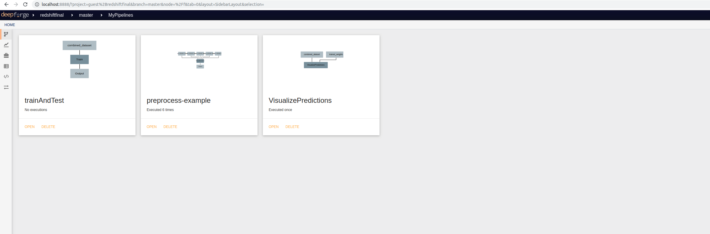

# Deepforge Implementation
We provide a deepforge implementation of the above project. Since, the exported model is too large, you can download it from [here](https://www.dropbox.com/s/55qyfb1xn0qttf6/guest%2Bredshiftfinal_94d17a.webgmex?dl=0) and run the pipeline.

The script above downloads the file and puts it in the data directory. There are three pipelines as shown in the screen-shot below:

